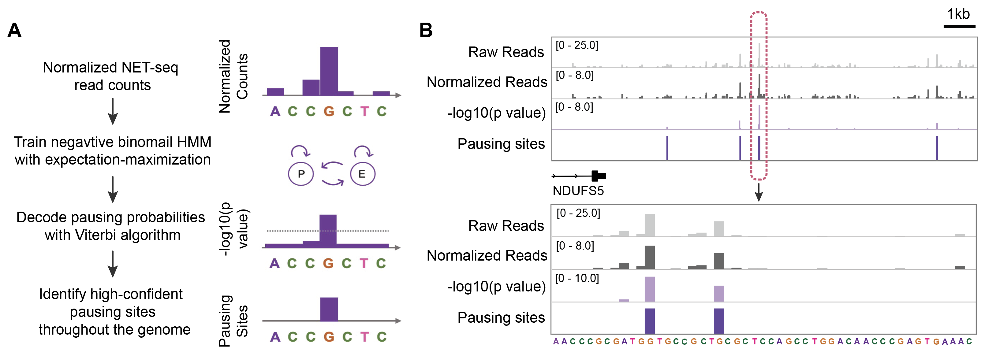

# Peak Calling from Sequencing Data at Nucleotide Resolution Using a Negative Binomial Hidden Markov Model (HMM)

This repository provides a Python implementation of a negative binomial hidden Markov model (HMM) for nucleotide-resolution peak calling. The algorithm is designed for high-resolution analysis of sequencing data and has been successfully applied to identify RNA Polymerase II (Pol II) pausing sites using Native Elongating Transcript sequencing (NET-seq) data.

## Overview

We use a custom HMM that models NET-seq read coverage with a negative binomial distribution to detect genome-wide Pol II pausing sites.

### Key Features

- Models read coverage using a negative binomial distribution to handle overdispersion.
- Identifies genome-wide peaks (e.g., pausing or binding sites) at single-nucleotide resolution.
- Suitable for NET-seq, ribosome profiling, and other similar high-resolution sequencing assays.
- Custom HMM implementation with flexible training and prediction workflows.

### HMM Framework



The model treats nucleotide-level read coverage as emissions from a two-state negative binomial HMM. One state represents background regions, while the other captures regions with significantly elevated signal, such as Pol II pausing sites.

## Example Use Case

This algorithm has been applied to identify transcriptional pausing sites of Pol II by training the model on NET-seq data from highly expressed genes.

## Getting Started

1. Clone the repository:
   ```bash
   git clone https://github.com/ShengShawnWang/peak-calling-nb-hmm.git
   cd peak-calling-nb-hmm
   ```

2. Set up your environment (change the environment name if needed):
   ```bash
   python -m venv venv
   source venv/bin/activate
   pip install -r requirements.txt
   ```

3. Prepare your input data:
   - Sense and antisense per-base read coverage BED files (e.g., from NET-seq).
   - Optionally, raw read counts for additional metadata.

4. Run the HMM training and prediction:
   ```bash
   python NB-HMM.py -s ./example/normalized_reads.+.bed -a ./example/normalized_reads.-.bed -t 1 -o ./example/
   ```

This will save the trained model as `hmm.pkl` and output predicted HMM p-value BED file tracks in the specified output directory.


## License

This project is licensed under the MIT License.


## Contact

For questions, suggestions, or issues, please open an issue on GitHub:
https://github.com/ShengShawnWang/nb-hmm-peak-calling/issues

